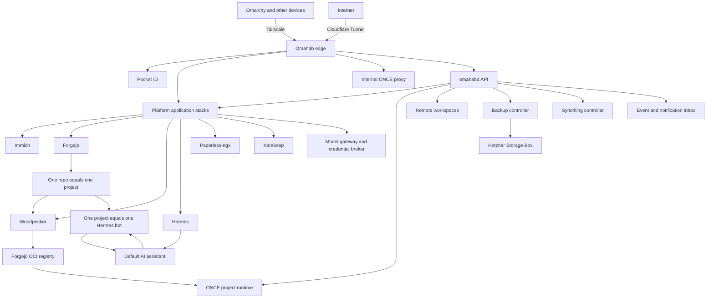

# Omahab Design

Status: consolidated product and architecture design

## 1. Product identity

The product name is **Omahab**. Technical identifiers are lowercase:

- CLI: `omahab`
- Daemon: `omahabd`
- Default paths: `/etc/omahab`, `/var/lib/omahab`, and `/srv/omahab`
- Repository and package names: lowercase `omahab`


Omahab is an opinionated, easy-to-install home server environment inspired by Omarchy's product principles: coherent defaults, minimal setup, standard tools underneath, excellent CLI support, and a deliberately designed end-to-end experience.

Suggested tagline:

> The opinionated home server.

During setup, users name their primary AI assistant. The default is:

- Display name: `AI`
- Slug: `ai`
- Stable Hermes profile ID: `default`
- Web address: `https://ai.<domain>`
- Email address: `ai@<domain>`

Changing the display name changes generated aliases and UI copy, but not the stable Hermes profile or its memory.

## 2. Product principles

1. Provide a paved road rather than a configuration buffet.
2. Use stable, familiar infrastructure beneath the opinionated interface.
3. Keep services private by default.
4. Make public exposure explicit, inspectable, and reversible.
5. Treat backup and verified recovery as product features.
6. Give every dashboard operation a stable CLI/API equivalent.
7. Make structured output available for agents.
8. Keep one-node operation excellent before considering clustering.
9. Pin, stage, health-check, and roll back updates.
10. Keep secrets out of Git, logs, Docker labels, and user-visible configuration.
11. Treat AI input, email, web content, repositories, and documents as potentially untrusted.
12. Prefer clean boundaries over forcing every workload through one runtime.
13. Avoid Kubernetes in the initial product.
14. Avoid local generative AI initially; remote providers are the default. Small local embedding models are an explicit exception.
15. Build as community software, not a commercial appliance or hosted control plane.

## 3. Initial scope

Omahab initially targets a single household with:

- one technical administrator;
- optional household members;
- one Omahab server;
- amd64 or arm64 hardware;
- either bare metal or a Proxmox virtual machine;
- Tailscale for private remote access;
- a custom domain hosted on Cloudflare;
- remote LLM providers and supported subscription OAuth;
- an Omarchy desktop companion.

The system supports data on the same disk as the OS. A separate data disk is recommended but not required; the first-run wizard can dedicate a disk to media or data after boot.

Omahab does not manage RAID or ZFS. On Proxmox, storage redundancy and snapshots remain Proxmox responsibilities. Home Assistant should normally run in its own Home Assistant OS VM and be connected to Omahab as an external integration.

Initial non-goals:

- Kubernetes;
- clustering and high availability;
- NAS/RAID/ZFS administration;
- media piracy stacks;
- local generative LLM serving;
- macOS or Windows companion applications;
- adopting arbitrary existing Docker hosts;
- self-hosting a general-purpose SMTP mailbox;
- consumer budgeting applications without reliable bank integration.

The host is now a declarative NixOS closure (see §5): the OS, all Omahab binaries, and every platform application form one generation-managed system. Docker remains only for user-project deploys (ONCE) and CI job containers.

## 4. System architecture



### 4.1 Host control plane

`omahabd` is a host-level service. It owns:

- installation and instance identity;
- platform application lifecycle;
- ONCE project deployment orchestration;
- the authenticated control API;
- exposure state and Cloudflare desired state;
- project metadata;
- Pocket ID integration;
- secret storage and projection;
- model provider credentials;
- backups and restore records;
- Syncthing folder metadata;
- remote workspace lifecycle;
- event history and notification policy;
- external integrations such as Home Assistant;
- application and host health.

Use SQLite for control-plane state initially. Application data remains in application-specific stores. SQLite is not a dumping ground for Paperless documents, photos, Git repositories, or application databases.

Recommended storage layout:

```text
/etc/omahab/
  configuration and non-secret host policy

/var/lib/omahab/
  control-plane database
  encrypted secrets
  instance identity
  install and update journal

/srv/omahab/
  apps/
  projects/
  sync/
  workspaces/
  backups/
  derived-indexes/
```

### 4.2 Implementation stack

Omahab-owned host software uses Go as its primary language. `omahab`, `omahabd`, `omahab-clientd`, and the installation, application, deployment, Cloudflare, backup, synchronization, workspace, event, email-processing, and health controllers are Go binaries. Use the current stable Go release pinned by each Omahab release.

The authenticated control API uses HTTP/JSON with an OpenAPI contract. Use the Go standard library with Chi for routing, Cobra for CLI commands, and generated Go and TypeScript API types. Use ordinary HTTP for commands and queries, Server-Sent Events for control-plane event streams, and WebSockets only where bidirectional behavior requires them, including Hermes's existing JSON-RPC transport. Do not add gRPC initially.

Use `database/sql` with `modernc.org/sqlite` so SQLite does not require a C toolchain, `sqlc` for typed queries, and explicit schema migrations. Durable jobs, desired and observed state, releases, and normalized events remain SQLite-backed state machines. Do not add Redis, a message broker, or an external workflow engine for the initial single-node product.

Browser applications use TypeScript, React, and Vite, with React Router, TanStack Query, and generated OpenAPI client types. Build static assets served by the Go control plane or Caddy; do not require a Node.js server in production. Reuse Hermes Desktop's existing React components and styling conventions rather than creating a second design system.

The Omarchy shell plugin remains a thin QML/JavaScript presentation layer over `omahab-clientd`. The Cloudflare Email Worker remains a minimal native TypeScript edge adapter. Local embedding inference remains an isolated Python worker because its model, tokenizer, and ONNX ecosystem are materially stronger there.

Language consolidation must not collapse failure domains. Embedding inference and other resource-heavy or native-library workloads remain outside `omahabd`, even when controlled through its API. Omahab orchestrates Caddy, `cloudflared`, Tailscale, restic, Syncthing, DevPod, `hass-cli`, Hermes, and the model gateway as upstream components rather than reimplementing them.

## 5. Host OS and installation

### 5.1 Base OS

The host is **NixOS**: the OS, Omahab's binaries, and every platform application are one declarative closure built from the repository flake (`nix/module.nix` + `nix/apps.nix`, pinned by `flake.lock`).

Reasons:

- the whole appliance — kernel, systemd units, nftables, sshd, tailscale, docker/podman, and the application services — is versioned as one generation with atomic switch and rollback;
- application versions track the pinned nixpkgs revision, so the flake lock is the release gate;
- no imperative package installation, no unattended-upgrades divergence, no installer journal — `nixos-rebuild` is the safety net;
- amd64 and arm64 availability.

Docker remains only for user-project deploys (ONCE) and CI job containers. Platform applications are native systemd services.

### 5.2 Installation form

Omahab ships appliance images and a NixOS module:

```sh
nix build .#image-iso     # bootable installer ISO
nix build .#image-qcow    # qcow2 appliance disk (Proxmox: import)
```

Or add to any NixOS host:

```nix
imports = [ github:davidgilesgt/omahab#nixosModules.omahab ];
services.omahab.enable = true;
```

`services.omahab.enable` is the only user-facing option; domain, tokens, and per-household values are runtime state, never in a `.nix` file.

### 5.3 First-boot bootstrap

On first boot the console (tty1) shows the LAN wizard URL and a one-time claim code; `omahabd` serves the wizard on `:8485` (LAN-only, per the nftables rules) while `/var/lib/omahab/bootstrap-done` is absent. The wizard claims the appliance with the code (single-use, rate-limited, rotated on exhaustion), installs SSH keys for the `omahab` admin account, enrolls Tailscale, and hands off to the authenticated dashboard over the tailnet; port 8485 then closes. `sudo omahab setup` is the SSH fallback for the same flow.

Secrets never transit the LAN page: everything after the Tailscale step happens on the authenticated dashboard.

### 5.4 Strict appliance posture

The system remains an appliance: it does not adopt arbitrary existing servers. Fresh-image boot is the only supported path; disaster recovery restores `/var/lib/omahab` + `/srv/omahab` from restic onto a fresh image.

### 5.5 SSH-first setup and hardening

sshd is hardened declaratively in the closure: pubkey-only, no password or keyboard-interactive authentication, no root login. SSH keys are runtime state (`~omahab/.ssh/authorized_keys`, provisioned by the first-boot wizard or `omahab setup`); GitHub import is one-time and never continuously synchronized. Because sshd configuration is atomic with the generation, the installer-era rollback timers are obsolete — `nixos-rebuild test`/`switch --rollback` is the recovery mechanism.

Default policy (from the module):

```text
PubkeyAuthentication yes
PasswordAuthentication no
KbdInteractiveAuthentication no
PermitRootLogin no
```

### 5.6 Host security baseline

- one NixOS closure, signed store paths, atomic generations with rollback;
- nftables default-deny inbound (`table inet omahab`); TCP 8484 only on tailscale0/lo; first-boot 8485 LAN-only and closed after bootstrap;
- no direct application port publication; native services bind loopback, Caddy is the only edge;
- Cloudflare Tunnel uses outbound connections;
- Docker socket available only to `omahabd`; CI builds use the rootless podman builder socket;
- root-owned secret material under `/var/lib/omahab` (0700/0600), per-bundle env files 0640 with service-user group;
- key-only SSH after bootstrap;
- health and security checks through `omahab doctor`;
- explicit, supervised upgrades (`omahab system upgrade` with health gate + automatic rollback); no unattended rebuilds.

## 6. Application runtime boundaries

Omahab deliberately uses different runtime designs for different workload classes behind one control plane.

### 6.1 Platform applications

Platform applications are **native NixOS systemd services** managed by `omahabd` — Caddy, Pocket ID, Forgejo, Woodpecker (server + agent), Immich, Paperless-ngx, Karakeep, Syncthing, LiteLLM, the embedding worker, ntfy, and Hermes (which runs as an `oci-containers` unit).

A platform bundle entry in the curated catalog declares:

- `id`, `name`, `port`, `default_exposure`, `max_exposure`;
- `health_check` (HTTP probes against the loopback port map, `kind`/`path`/`port`);
- `data` (persistent-data locations, `name`/`path` pairs under `/srv/omahab` and `/var/lib/<svc>`);
- `backup` (`pre_backup`/`post_restore` native commands, e.g. `pg_dump -Fc <db> -f /var/lib/omahab/dumps/<db>.pgdump` and `pg_restore --clean --if-exists -d <db> ... && systemctl restart <unit>`);
- `oidc` (`supported`/`mode`/`provider` for native OIDC via Pocket ID);
- `resources` (`memory_mb` guidance);
- `default` (whether installed by default);
- `route` (subdomain prefix or templated host e.g. `ai.{{.Domain}}`);
- `dependencies`, `secret_sources`, `pipeline_image`;
- `units` (systemd units, required for every bundle).

Domain-dependent units gate on their `appenv/<bundle>.env` file: before enrollment systemd skips them cleanly (condition-skip, not failure); `omahabd` renders the env file after enrollment and starts the units. Versions of native services track the nixpkgs pin — there is no per-app image update; `omahab system upgrade` switches the whole generation.

Users do not edit application configuration; everything flows through omahabd.

### 6.2 Project applications

User-created projects deploy through ONCE by default.

Default project contract:

- one repository;
- one OCI image;
- HTTP on port 80;
- `/up` health endpoint;
- persistent state in `/storage`;
- SQLite preferred for small projects requiring a database;
- secrets supplied by Omahab;
- image built by Woodpecker;
- image stored by digest in the Forgejo registry.

A project that requires PostgreSQL, Redis, multiple workers, or several independently deployed components has outgrown the default ONCE contract. A future explicit stack runtime may support that case, but it must not be hidden inside a fake single-container image.

### 6.3 ONCE fork boundary

Omahab is not a supersized ONCE fork. ONCE's current assumptions include one container and volume per app, Docker labels as state, and application secrets in Docker-managed configuration. Those assumptions do not fit users, projects, external services, synchronization, identity, or the Omahab secrets model.

Maintain a narrow fork `third_party/once` in this repository (patch list in `third_party/once/PATCHES.md`) for project deployment. Keep its patch set suitable for upstreaming:

1. configurable proxy bind address, including loopback;
2. external TLS mode;
3. structured JSON output;
4. lifecycle event hooks;
5. external secrets-file support;
6. machine-readable deployment and health status;
7. an external-state interface if upstream accepts it.

Do not add Pocket ID, Immich, Hermes, DNS, device management, or project records to the ONCE fork.

Edge topology:

```text
Caddy/Omahab edge :80/:443
  ├── native platform services on 127.0.0.1:<port>
  ├── hermes container on 127.0.0.1:8085
  └── ONCE Kamal Proxy on 127.0.0.1:8080
        └── project containers
```

Caddy owns external TLS and host routing, routing to loopback upstreams (compose-internal DNS names no longer resolve). ONCE operates on a loopback internal port with internal TLS disabled.

### 6.4 Deployment flow

```text
git push
  -> Woodpecker tests and builds
  -> image pushed to Forgejo registry
  -> Woodpecker calls narrow omahabd release endpoint
  -> omahabd validates project, commit, and digest
  -> omahabd invokes ONCE
  -> health check
  -> release recorded
  -> previous release retained for rollback
```

Woodpecker receives no host SSH key or broad Omahab administrator credential.

## 7. Networking, DNS, and exposure

### 7.1 Requirements

The supported happy path requires:

- a custom domain;
- DNS hosted by Cloudflare;
- Tailscale for private remote access.

Bootstrap and recovery cannot depend exclusively on the custom domain. The server remains reachable through its Tailscale IP, `*.ts.net` name, SSH, or local console.

### 7.2 No split DNS

Private services use public DNS records that resolve to the server's stable Tailscale IP. The address resolves publicly but is routable only by authorized tailnet devices.

Example private state:

```dns
ai.example.com       CNAME  ai.home.example.com
ai.home.example.com  A      100.x.y.z
```

These are Cloudflare DNS-only records. They are not orange-cloud proxied.

Public state:

```dns
ai.example.com       CNAME  <tunnel-id>.cfargotunnel.com
ai.home.example.com  A      100.x.y.z
```

`omahabd` changes the vanity record when exposure changes. The private `.home` anchor remains stable.

Consequences:

- no local DNS server is required;
- all clients must use Tailscale for private services;
- service names and tailnet IPs are visible in public DNS;
- aggressive DNS-rebinding filters may require fallback to `*.ts.net`;
- replacing the server's Tailscale identity requires DNS updates.

The installer and companion test resolution, certificate validity, routing, Tailscale identity, and Omahab instance identity before reporting success.

### 7.3 Exposure modes

Every service has one state:

1. **Private**: vanity CNAME resolves through the private `.home` record to the Tailscale IP.
2. **Shared**: Cloudflare Tunnel publishes the service behind an identity gate.
3. **Public**: Cloudflare Tunnel publishes the service without the shared identity gate.

Changing exposure shows:

- resulting hostname;
- current authentication mechanism;
- public route changes;
- application-level authentication status;
- warnings before making unauthenticated services public.

Use official `cloudflared`. Do not add DockFlare as a second desired-state controller because `omahabd` already owns Docker and Cloudflare state.

`omahabd` uses the official Cloudflare Go SDK behind a narrow internal desired-state interface. Generated SDK types must not become the Omahab domain model. Pin the SDK version per release and retain separate clients or credential instances for each scoped token.

### 7.4 Cloudflare credentials

Use separate scoped tokens for:

- DNS changes;
- Tunnel and Access changes;
- Email Worker/routing changes.

Never request a global API key or one account-wide super-token.

## 8. Identity and users

### 8.1 Pocket ID

Pocket ID is the initial identity provider. Configure it as passkey-first OIDC and disable email one-time-access login by default.

Initial groups:

- `admins`;
- `members`;
- `guests`.

The Omahab dashboard manages users through Pocket ID's supported API:

- create user;
- disable user;
- create expiring enrollment link;
- assign groups;
- inspect enrollment state;
- initiate recovery;
- show application access.

Omahab does not implement password or passkey verification itself.

Use native OIDC where supported, including Forgejo, Immich, Paperless-ngx, and Karakeep. Generic edge authentication is reserved for browser-only applications that lack OIDC; it must not break native mobile or API clients.

Disabling identity and deleting application data are separate operations. Removing a Pocket ID user must not automatically delete photos, documents, Git repositories, or project history.

### 8.2 Administrator enrollment

The first administrator should enroll two passkeys, such as:

- a password-manager passkey;
- a hardware or platform authenticator.

Setup is not complete until permanent recovery has been tested.

### 8.3 Permanent recovery

Do not create a permanent static web recovery token. Administrative SSH or local root access is the permanent recovery capability.

```bash
ssh omahab
sudo omahab identity recover admin@example.com
```

The recovery command:

1. requires local root or narrowly authorized `sudo`;
2. generates a short-lived Pocket ID login code;
3. prints an expiring enrollment URL;
4. records a security event;
5. permits registration of a replacement passkey.

Recovery layers:

1. primary passkey;
2. second passkey;
3. standard SSH key over Tailscale or LAN;
4. local console and `sudo omahab identity recover`;
5. encrypted Omahab recovery kit for complete restoration.

The recovery kit decrypts restored state. It is not a web login token.

## 9. Secrets

Do not require OpenBao or Vault initially. `omahabd` owns a small secrets broker.

Properties:

- secrets encrypted individually at rest;
- provider, platform-app, project, and user scopes;
- values never returned by the dashboard after entry;
- atomic rotation;
- secret files projected through protected temporary mounts where supported;
- environment variables only when upstream has no file mechanism;
- logs and audits contain secret IDs, never values;
- backups contain encrypted secret state.

Key model:

- generate a random Omahab master key;
- seal it with TPM2 when available;
- use a root-only local fallback otherwise;
- encrypt a recovery copy to a user-held `age` recovery key;
- require recovery-key export during setup;
- recommend LUKS on bare metal and encrypted Proxmox storage for VMs.

Omahab does not claim to protect secrets from root on a running compromised host. Encryption protects backups and offline storage.

## 10. Model providers and subscriptions

LiteLLM is the sole network-facing model gateway. All model traffic from Hermes, coding harnesses, and other Tailscale clients passes through LiteLLM; no client receives an upstream provider credential or the LiteLLM master key.

Remote models are the default. Omahab supports both:

1. API-key providers through LiteLLM.
2. Provider-sanctioned subscription OAuth wired through LiteLLM.

Initial credential types:

- OpenAI API;
- Anthropic API;
- OpenRouter;
- ChatGPT subscription OAuth where supported;
- xAI Grok OAuth for eligible SuperGrok or X Premium+ subscriptions.

The setup dashboard conducts device authorization, stores refresh credentials through the secrets broker, reports entitlement separately from expiration, and supports revoke/reauthorize. Provider-sanctioned OAuth only; if a provider removes the documented flow or rejects the subscription tier, mark it unavailable/not-entitled and require its API-key path. Never extract browser cookies or copy consumer session state.

Gateway boundary:

- Serve clients only through the private `https://models.<domain>` Caddy/Tailscale route (DNS-only `models.home.<domain>` → Tailscale IP; no Cloudflare Tunnel public exposure). Do not publish LiteLLM port 4000 to the host and do not permit `shared` or `public` exposure for the model gateway.
- Keep the OpenAI-compatible endpoint at `https://models.<domain>/v1`; also preserve LiteLLM's native Anthropic-compatible `/v1/messages` endpoint for harnesses that support an Anthropic base URL.
- Give Hermes (`default` profile), each enrolled companion device, and each separately registered harness a distinct LiteLLM virtual key with scoped aliases and per-key RPM/TPM/concurrency. Never give any client the LiteLLM master key or an upstream credential.
- Keep `omahab/fast`, `omahab/balanced`, `omahab/reasoning`, and `omahab/embedding` as the stable model names. Alias changes update LiteLLM without changing client configuration.
- Default to no cross-provider fallback. A subscription quota, entitlement failure, or `429` must not silently incur metered API charges; an administrator may explicitly add and order a paid fallback later through the alias configuration.
- Treat provider quota dashboards as authoritative for subscription caps. LiteLLM tracks returned token usage, per-key RPM/TPM/concurrency, and API-key spend, but must not present estimated subscription cost as a provider quota balance.

Rules:

- supported OAuth or API credentials only;
- no browser-cookie extraction;
- no reverse-engineered consumer session cookies;
- no provider token in logs, Docker labels, or user-visible configuration;
- prefer auth files over environment variables for gateway-managed OAuth state;
- show provider, quota, fallback, and current health;
- handle subscription-tier `403` as entitlement failure, not token corruption.

Applications receive model aliases and scoped virtual keys rather than upstream credentials. Possible aliases:

```text
omahab/fast
omahab/balanced
omahab/reasoning
omahab/embedding
```

No prompt-content logging by default. LiteLLM is configured with `general_settings.store_prompts_in_spend_logs: false` and `litellm_settings.turn_off_message_logging: true`; spend/error metadata needed for limits and diagnosis is retained, but no external callbacks are configured and prompts/responses are never persisted. The canary checked in verification is that a unique prompt canary never appears in LiteLLM container logs or spend rows.

## 11. Git and CI

### 11.1 Forgejo

Forgejo is the canonical Git system and is private by default.

### 11.2 Woodpecker only

Use Woodpecker for all CI. Disable Forgejo Actions to avoid two pipeline languages, runners, log systems, secret systems, and agent integrations.

Woodpecker supplies:

- pipeline API and CLI;
- run and log access;
- artifacts;
- commit status integration;
- isolated runners;
- build and release pipelines.

If Forgejo later gains a complete supported run/log/artifact/cancel/rerun API, evaluate a clean migration. Do not operate both systems indefinitely.

### 11.3 GitHub public mirrors

A project may publish a read-only mirror to GitHub using Forgejo push mirroring.

Rules:

- Forgejo remains canonical;
- GitHub is treated as read-only;
- warn that push mirroring force-pushes and overwrites GitHub-side changes;
- use a repository-scoped credential where possible;
- branches, tags, and commits are mirrored;
- issues, PRs, CI state, releases, and project settings are not implied to be mirrored;
- handle Git LFS separately and explicitly.

## 12. Project model

Initial invariant:

> One repository equals one project.

Prefer a monorepo. If an external repository must be included, use a Git submodule or package manager rather than an unnoticed nested `.git` directory.

A project owns:

- one Forgejo repository;
- one Hermes project bot;
- one project secret namespace;
- one default ONCE deployment;
- zero or more deployment environments;
- zero or more remote workspaces;
- one CI pipeline family;
- optional GitHub mirror configuration;
- project event history.

A project manifest may describe repository-owned, non-secret behavior. Mutable deployment state and secrets remain in `omahabd`.

Project synchronization on Omarchy is intentional:

- automatic clone when requested;
- background fetch;
- clear clean/dirty/ahead/behind status;
- explicit pull, commit, and push;
- no silent commits, merges, or force-pushes.

## 13. Hermes and bots

### 13.1 Default assistant

The stable Hermes `default` profile is the primary assistant. Its default display name is `AI`, but the user can rename it during setup. The `default` profile's inference base URL and API key point at the centralized LiteLLM gateway (`https://models.<domain>/v1` with `ANTHROPIC_BASE_URL` at `https://models.<domain>` for `/v1/messages`), using a distinct per-profile LiteLLM virtual key. Connecting a tool gateway (e.g., Nous Portal) must not switch the inference provider.

### 13.2 Project bots

Each project gets one Hermes bot. Under Hermes, a bot is a profile.

A project bot receives only:

- its project repository;
- project issues and pull requests;
- project deployment state;
- project-specific secrets;
- project files explicitly attached to it;
- its own memory and session history.

It does not receive:

- default-assistant memory;
- unrelated Paperless documents;
- general synced notes;
- Home Assistant credentials;
- other repositories;
- other project bot transcripts.

LLM inference for both the default assistant and project bots goes through the centralized LiteLLM gateway at `https://models.<domain>` via scoped virtual keys (`omahab/fast`, `omahab/balanced`, `omahab/reasoning`, `omahab/embedding`). No bot receives an upstream provider credential or the LiteLLM master key. Tool and application credentials remain isolated. The Nous Portal tool gateway (pay-as-you-use web search/extract, image generation, TTS, cloud browser) is a separate Hermes tool integration and does not change the inference gateway.

### 13.3 Bot authority and communication

```text
Default AI
  -> assigns work to project bots
  -> requests status and summaries
  -> redirects or cancels delegated work

Project bot
  -> works only within its project
  -> reports to the default AI
  -> asks the default AI bounded questions
```

A project bot cannot inspect the default assistant's memory. It sends a question through Hermes bot messaging and receives only the response. Project bots do not message one another by default; communication routes through the default assistant unless the user explicitly creates a group.

Use Hermes's existing bot chats, `@mentions`, direct bot messages, and group chats. Project bot instructions establish project-only scope and escalation to the default assistant.

### 13.4 Desktop-quality web UI

The server should provide a web experience based on Hermes Desktop's React UX rather than relying only on the current administrative dashboard.

Implementation direction:

- reuse/extract the Desktop React surface;
- retain Hermes's shared WebSocket/JSON-RPC transport;
- replace Electron native operations with authenticated remote gateway capabilities;
- keep tool execution on the server;
- authenticate through the configured identity path;
- upstream reusable browser/renderer separation where possible.

Implement the browser surface as a TypeScript React application built with Vite. It consumes generated OpenAPI types for control-plane operations and the existing Hermes WebSocket/JSON-RPC protocol for chat. Ship static assets; do not add a production Next.js or other Node.js server.

Do not run Electron through VNC as the web product.

### 13.5 Official Hermes Desktop client

Do not fork Hermes Desktop merely to connect it remotely. Current Hermes Desktop supports connecting to an existing remote Hermes instance during first launch without requiring a local Hermes runtime.

The Omarchy companion:

1. verifies Tailscale connectivity;
2. determines the configured AI URL;
3. provisions supported non-secret remote connection metadata where possible;
4. launches the official Hermes Desktop build;
5. lets Hermes perform its official OAuth/token flow.

Do not synthesize Electron `safeStorage` records or copy cookies. If automatic configuration is not supported, open the official connection flow with the server URL ready to paste. A small upstream provisioning/deep-link feature is preferable to a fork.

## 14. Remote workspaces and coding agents

The Omarchy companion can create an isolated remote runner for a project:

1. request workspace creation from `omahabd`;
2. clone the project and selected branch;
3. apply `.devcontainer/devcontainer.json` or an Omahab default;
4. install the selected coding agent, such as OMP or Codex;
5. create a resumable terminal session;
6. open the local terminal over Tailscale;
7. attach using a short-lived capability;
8. stop idle workspaces automatically.

Use the Development Container specification. DevPod is a likely implementation primitive, but the product API remains Omahab's.

Workspace containers do not receive the Docker socket or production secrets. A container is not a sufficient boundary for hostile external pull requests. Automated review of untrusted code runs in a dedicated worker VM or microVM; on Proxmox, a separate worker VM is the initial safe recommendation.

Deployments use immutable image digests, never a mutable workspace checkout.

## 15. Knowledge and documents

### 15.1 Paperless-ngx

Paperless-ngx is the authoritative document-management application. Use its REST API for retrieval and document operations.

Initial assistant tools should cover:

- search documents;
- retrieve metadata and extracted text;
- list correspondents, document types, and tags;
- upload a document;
- add a tag;
- return source IDs and deep links.

Hermes retrieves relevant material instead of injecting the full archive into every conversation.

### 15.2 Local semantic indexing

Local semantic indexing is offered during setup:

```text
Semantic document search

- Best English model
- Best worldwide model
- Full-text search only
```

Do not infer the choice from the user's country or documents.

Stable internal aliases:

```text
omahab-embed-english
omahab-embed-worldwide
```

Omahab pins the actual model for each release based on a repeatable Paperless retrieval benchmark. The UI displays model name, license, download size, and expected memory. Model replacement triggers a background re-index while the previous index remains usable.

Candidate families to benchmark include:

- English: Nomic Embed Text v1.5 or a stronger English-optimized model in the same local resource class;
- Worldwide: Nomic Embed Text v2 MoE and Qwen3 Embedding 0.6B.

Embedding inference runs in an isolated Python worker on local CPU, preferably through ONNX Runtime or another efficient runtime. The worker owns model-specific tokenization, inference, pooling, normalization, and batching. `omahabd` owns model selection, pinned artifact metadata, source permissions, indexing jobs, and re-index state. A worker failure or memory spike must not take down the host control plane.

Store vectors with source document, page/chunk, and content checksum. The index is sensitive derived data and follows Paperless permissions and backup policy. The Python worker receives only the content and scoped job metadata required for its current work; it is not a general local model server and receives no provider credentials.

Remote document summarization is separate. Before sending private document text to a remote LLM, show the provider and require an informed choice.

### 15.3 Karakeep

Karakeep is the default place for articles, bookmarks, ideas, PDFs, images, videos, and RSS capture because it provides:

- full-page archiving;
- full-text and semantic search;
- LLM tagging and summaries;
- browser and mobile clients;
- RSS ingestion;
- API and CLI;
- Hermes-compatible agent skills.

Saving an individual X/Twitter post should use a browser-side **Save to Omahab** action that captures the visible post and URL. Do not store the user's X browser cookie on the server or depend on fragile authenticated scraping. Bulk bookmark import can come later through a supported API or user data export.

### 15.4 Knowledge-source boundary

Canonical data remains in Paperless, Karakeep, Forgejo, synced folders, and the email inbox. Omahab provides tools and derived indexes; it does not silently copy every source into Hermes memory.

## 16. Syncthing and notes

Syncthing is primarily a synchronization feature. Restic remains the backup system.

Simple folder setup:

```text
Name: Notes
Local folder: ~/Documents/Notes
Share with AI: enabled/disabled
```

This action:

1. creates the server-side Syncthing folder;
2. enrolls the Omarchy device;
3. opens or creates the local path;
4. applies sensible exclusions;
5. indexes supported text files when sharing is enabled;
6. includes the server copy in normal Omahab backup unless globally excluded.

`Share with AI` means the default assistant can list, search, and read the folder. Project bots cannot access it. Writes use normal Hermes file/command approvals and conflict-safe file updates.

For Obsidian, exclude transient state such as:

```text
.obsidian/workspace*
.obsidian/cache/
.obsidian/plugins/*/data.json
.trash/
.stversions/
*sync-conflict*
```

Omahab does not expose a separate Syncthing-to-Hermes bridge. `omahabd` knows the synchronized server folder and registers it as a default-assistant knowledge source.

Never synchronize active `.git` directories through Syncthing. Git projects synchronize through Forgejo.

## 17. Home Assistant

Home Assistant normally runs in a separate Home Assistant OS VM on Proxmox. Omahab does not install, update, or back up that VM initially.

During setup, offer an optional direct CLI integration:

```text
Connect Home Assistant?
Home Assistant URL: ...
Long-lived access token: ...
```

Omahab:

1. installs `hass-cli` in the Hermes runtime;
2. stores `HASS_SERVER` and `HASS_TOKEN` for the default Hermes profile;
3. installs a concise Hermes skill describing `hass-cli` usage;
4. validates a read operation.

Do not add an MCP server and do not proxy or wrap `hass-cli` commands through Omahab. Hermes invokes `hass-cli` directly. Project bots do not receive the Home Assistant token.

Hermes's own command approval system remains responsible for approving state-changing calls.

## 18. Receiving-only AI email

Cloudflare Email Workers provide the receiving edge. Omahab does not self-host a general SMTP server.

The assistant's name generates the address. Default:

```text
ai@example.com
```

Enrollment:

1. administrator enters the only allowed personal sender address;
2. Omahab creates the AI email route;
3. administrator sends or forwards a test email;
4. Omahab verifies authentication and exact sender;
5. route activates only after successful verification.

Positive authentication policy for HEY or another properly signing provider:

- exact header sender matches the registered address;
- valid DKIM signature;
- signed `From` header;
- signing-domain/DMARC alignment;
- optional randomized recipient alias as an additional secret;
- HMAC-authenticated Worker-to-`omahabd` webhook;
- replay protection and size limits.

The Email Worker is a small TypeScript transport adapter. It enforces envelope and raw-size limits, attaches timestamp and nonce metadata, HMAC-authenticates the raw message and metadata, and submits them to a narrow `omahabd` ingestion endpoint. It does not parse MIME, decide sender trust, or trigger application actions.

Go code in `omahabd` performs replay protection, MIME processing, exact-sender checks, DKIM verification, signed-`From` verification, signing-domain/DMARC alignment, attachment policy, quarantine, and routing to Paperless, Karakeep, or the AI inbox. Authentication and processing policy therefore have one authoritative implementation.

DKIM proves responsibility by the signing domain and protects the signed `From` header. It still relies on the provider enforcing mailbox sender identity. Personal PGP/S/MIME or authenticated HTTPS upload is required for stronger individual cryptographic identity.

Messages remain untrusted content. They never directly authorize purchases, shell commands, deployments, or Home Assistant actions.

Per-sender processing policy may:

- store the message in the AI inbox;
- send PDF attachments to Paperless;
- save links to Karakeep;
- quarantine unexpected attachments;
- perform more than one of these.

No outbound AI email or automatic reply is required initially.

## 19. Backups and recovery

Use restic as the backup engine. Hetzner Storage Box over SFTP is the recommended destination, with other restic-compatible destinations possible later.

Back up:

- encrypted Omahab control state;
- service configuration;
- Forgejo repositories and required metadata;
- application-aware database dumps;
- Immich uploaded media and database;
- Paperless documents and database;
- Karakeep data;
- shared Syncthing server folders;
- project persistent data;
- secret ciphertext and recovery metadata.

Application bundles supply pre-backup and post-restore hooks. Database consistency is mandatory. Copying only live database files is not considered a valid backup.

Initial objectives:

- recovery point objective: no more than 24 hours;
- recovery time objective: approximately four hours for the supported single-node restore path;
- periodic automated restore verification;
- visible last backup and last verified restore status.

A backup is not healthy until Omahab has demonstrated that it can restore the relevant data.

Syncthing versioning may provide a convenience buffer, but synchronization is not the off-site backup mechanism.

## 20. Events and notifications

Build a normalized event system, but do not enable phone push by default.

Initial event types include:

```text
backup.failed
backup.restored
host.disk_low
service.unhealthy
service.update_available
ci.failed
deployment.completed
agent.awaiting_approval
syncthing.conflict
syncthing.device_stale
email.received
email.quarantined
```

Default surfaces:

- Omahab dashboard inbox;
- Omarchy status-bar badge;
- project activity;
- optional digest from the default AI.

ntfy is an optional delivery adapter. Initial onboarding creates no phone subscription.

## 21. Omarchy companion

Only Omarchy is supported initially.

### 21.1 Local daemon

`omahab-clientd` is a Go user-level service that:

- authenticates with `omahabd`;
- verifies Tailscale state and instance identity;
- tracks projects and remote runners;
- performs background Forgejo fetches;
- enrolls Syncthing folders;
- provides a local Unix socket to the shell plugin;
- launches Hermes Desktop and terminals;
- stores local credentials through the desktop keyring.

### 21.2 CLI

```text
omahab status
omahab project create
omahab project clone
omahab project open
omahab runner create
omahab runner attach
omahab runner stop
omahab sync add
omahab hermes open
```

Interactive `install`, `status`, and `doctor` views use the same domain operations as normal CLI and JSON output; business logic does not live in Bubble Tea models. Full-screen behavior is optional and enabled only on a suitable TTY.

### 21.3 Omarchy shell plugin

A user-owned Quickshell plugin such as `omahab.status` displays:

- server online/offline;
- active runners;
- waiting agent turns;
- Syncthing conflicts;
- unread Omahab events.

Actions:

- Open AI;
- New project;
- Clone project;
- Start or resume remote runner;
- Open Omahab;
- Diagnose connection.

The QML plugin talks only to `omahab-clientd` and stores no server or provider secrets.

### 21.4 Tailscale checks

Before opening an Omahab surface, the companion verifies:

1. Tailscale is installed;
2. the device is logged into the expected tailnet;
3. the expected server node is visible;
4. the custom hostname resolves to the expected Tailscale IP in private mode;
5. the HTTPS certificate is valid;
6. Pocket ID is reachable;
7. `omahabd` returns the enrolled instance ID.

Never silently fall back from a private Tailscale route to a public route.

## 22. Core application catalog

Initial core applications and integrations:

- Immich;
- Forgejo;
- Woodpecker CI;
- Hermes backend;
- desktop-quality Hermes web surface;
- Pocket ID;
- model gateway and subscription credential support;
- Paperless-ngx;
- Karakeep;
- Syncthing;
- optional ntfy delivery;
- optional external Home Assistant through direct `hass-cli`.

Applications not selected for the initial default:

- self-hosted budget apps without Plaid-quality account connectivity;
- a broad Nextcloud/groupware stack;
- local generative model serving;
- media acquisition stacks;
- general-purpose mail hosting.

## 23. Release sequence

### 23.1 Architectural spikes

1. Narrow ONCE fork in `third_party/once`: loopback binding, JSON status, secret files, lifecycle hooks.
2. Cloudflare public-DNS-to-Tailscale routing and Caddy DNS-01 certificates.
3. Official Hermes Desktop remote provisioning without a fork.
4. Desktop-quality Hermes React surface in a browser.
5. ChatGPT and Grok subscription OAuth with centralized encrypted storage.
6. HEY DKIM enrollment and PDF routing.
7. English and worldwide local embedding benchmark.

### 23.2 Foundation release

- NixOS closure, appliance images, and the first-boot console wizard;
- one-time claim code + LAN bootstrap, SSH-key enrollment, declarative sshd hardening;
- amd64 and arm64 support;
- same-disk and separate-data layouts;
- `omahabd` and control database;
- Tailscale;
- Cloudflare DNS and Tunnel;
- Caddy edge;
- Pocket ID and SSH recovery;
- secrets broker;
- backup controller;
- event inbox.

### 23.3 First usable personal server

- default AI assistant;
- official Hermes Desktop remote connection;
- Omarchy companion;
- Forgejo;
- Woodpecker only;
- ONCE project deployment;
- Immich;
- private/shared/public exposure;
- backup and verified restore.

### 23.4 Knowledge and home release

- Paperless-ngx;
- English/worldwide local semantic search options;
- Karakeep;
- Syncthing folders;
- Obsidian-friendly Notes flow;
- authenticated AI email;
- direct `hass-cli` integration.

### 23.5 Projects and workspaces release

- one repo equals one project;
- one project equals one isolated Hermes bot;
- bot coordination through the default AI;
- project creation and local clone;
- OCI build and deployment;
- GitHub mirrors;
- remote Dev Container runners;
- OMP and Codex launchers;
- isolated automated reviewers.

## 24. Load-bearing acceptance scenarios

Omahab is not complete until these scenarios work end to end.

### Installation and recovery

1. Boot the appliance image on a fresh machine.
2. Claim it with the one-time code from the LAN wizard and install SSH keys.
3. Join Tailscale and configure Cloudflare from the dashboard.
4. Enroll two passkeys.
5. Lose passkey access.
6. Recover through SSH without modifying the database manually.

### Private and public exposure

1. Install a service privately.
2. Resolve its custom hostname to a Tailscale IP.
3. Confirm it is unreachable outside Tailscale.
4. switch it to shared or public;
5. confirm Cloudflare route behavior;
6. return it to private and confirm public access is removed.

### Backup and disaster recovery

1. Install Immich and upload photos.
2. Create Forgejo repositories and project data.
3. Configure encrypted Hetzner backup.
4. Destroy the Omahab machine.
5. Boot a fresh appliance image on a replacement.
6. Restore the recovery kit and backup.
7. Confirm photos, databases, repositories, identities, and projects are usable.

### Project deployment

1. Create a project from the Omarchy companion.
2. Clone it locally.
3. Push a change.
4. Observe a Woodpecker build.
5. Deploy the OCI digest through ONCE.
6. verify private custom-domain access;
7. roll back to the previous release.

### AI and project isolation

1. Name the default assistant.
2. Create two projects and bots.
3. Confirm each bot can see only its own repository and state.
4. Have a project bot ask the default assistant a question.
5. Have the default assistant assign work and request status.
6. Confirm neither project bot can inspect unrelated notes or projects.

### Notes and documents

1. Create a synced Notes folder from Omarchy.
2. Open it as an Obsidian vault.
3. Enable Share with AI.
4. Search notes through the default assistant.
5. Install Paperless with English or worldwide embeddings.
6. Retrieve a document with a source citation.
7. Restore the notes and Paperless data from backup.

### Email ingestion

1. Enroll the administrator's exact HEY address.
2. Verify a signed test message.
3. Forward a receipt with PDF attachment.
4. Store the message for the AI and the PDF in Paperless according to policy.
5. Reject or quarantine a spoofed or unauthenticated sender.

## 25. External references

- NixOS manual: <https://nixos.org/manual/nixos/stable/>
- nixpkgs: <https://github.com/NixOS/nixpkgs>
- NixOS flakes: <https://nixos.wiki/wiki/Flakes>
- ONCE README: <https://github.com/basecamp/once/blob/main/README.md>
- ONCE architecture: <https://github.com/basecamp/once/blob/main/AGENTS.md>
- ONCE proxy implementation: <https://github.com/basecamp/once/blob/main/internal/docker/proxy.go>
- Immich requirements: <https://docs.immich.app/install/requirements/>
- Immich deployment: <https://docs.immich.app/install/docker-compose/>
- Immich backup: <https://docs.immich.app/administration/backup-and-restore/>
- Forgejo mirrors: <https://forgejo.org/docs/v15.0/user/repo-mirror/>
- Woodpecker Forgejo integration: <https://woodpecker-ci.org/docs/next/administration/configuration/forges/forgejo>
- Woodpecker CLI: <https://woodpecker-ci.org/docs/next/cli>
- Pocket ID: <https://pocket-id.org/docs/>
- Pocket ID user management: <https://pocket-id.org/docs/setup/user-management>
- Pocket ID recovery: <https://pocket-id.org/docs/troubleshooting/account-recovery>
- Hermes Desktop: <https://github.com/NousResearch/hermes-agent/blob/main/apps/desktop/README.md>
- Hermes Bot Mode: <https://hermes-agent.nousresearch.com/docs/user-guide/bot-mode>
- Hermes Grok OAuth: <https://hermes-agent.nousresearch.com/docs/guides/xai-grok-oauth>
- LiteLLM ChatGPT subscriptions: <https://docs.litellm.ai/docs/providers/chatgpt>
- Paperless API: <https://github.com/paperless-ngx/paperless-ngx/blob/main/docs/api.md>
- Karakeep: <https://docs.karakeep.app/>
- Karakeep agent skills: <https://docs.karakeep.app/integrations/agentic-skills/>
- Nomic Embed Text v1.5: <https://huggingface.co/nomic-ai/nomic-embed-text-v1.5>
- Nomic Embed Text v2 MoE: <https://huggingface.co/nomic-ai/nomic-embed-text-v2-moe>
- Qwen3 Embedding 0.6B: <https://huggingface.co/Qwen/Qwen3-Embedding-0.6B>
- Syncthing versioning: <https://docs.syncthing.net/users/versioning.html>
- Home Assistant CLI: <https://github.com/home-assistant-ecosystem/home-assistant-cli>
- Cloudflare Email Workers: <https://developers.cloudflare.com/email-service/api/route-emails/email-handler/>
- DKIM RFC 6376: <https://www.rfc-editor.org/rfc/rfc6376>
- Cloudflare Tunnel DNS: <https://developers.cloudflare.com/cloudflare-one/networks/connectors/cloudflare-tunnel/routing-to-tunnel/dns/>
- Tailscale DNS: <https://tailscale.com/docs/reference/dns-in-tailscale>
- Tailscale SSH: <https://tailscale.com/docs/features/tailscale-ssh>
- Development Container specification: <https://containers.dev/implementors/spec/>
- Cloudflare Go SDK: <https://developers.cloudflare.com/api/go/>
- Chi router: <https://github.com/go-chi/chi>
- Cobra CLI: <https://github.com/spf13/cobra>
- sqlc: <https://sqlc.dev/>
- modernc.org SQLite: <https://pkg.go.dev/modernc.org/sqlite>
- Bubble Tea: <https://github.com/charmbracelet/bubbletea>
- Huh: <https://github.com/charmbracelet/huh>
- ONNX Runtime: <https://onnxruntime.ai/>
